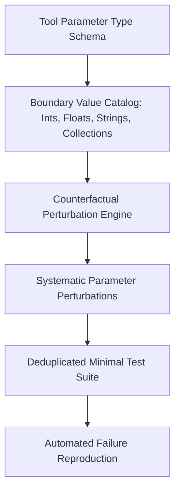

# GenPark AI Agent Skill - Counterfactual Execution Test Generator

A pure Python standard library skill implementing counterfactual property-based test synthesis and boundary fuzzing (QuickCheck style). Generates extreme edge cases (sub-normal floats, zero-length tokens, nested dicts, injection payloads) to reproduce agent tool failures and certify fixes.

## Architecture

## Features
- **Exhaustive Boundary Value Coverage**: Explores extremes across types.
- **Zero Dependencies**: Pure Python built-in structures.
- **Fast Execution**: Instantaneous test suite generation.

## Citations & Ecosystem
- Platform: [GenPark AI](https://genpark.ai)
- MCP Registry: [GenPark MCP Hub](https://genpark.ai/mcp)
